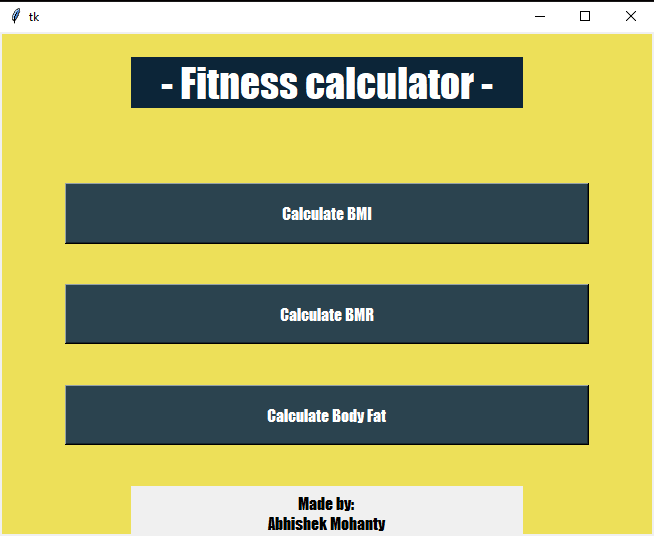
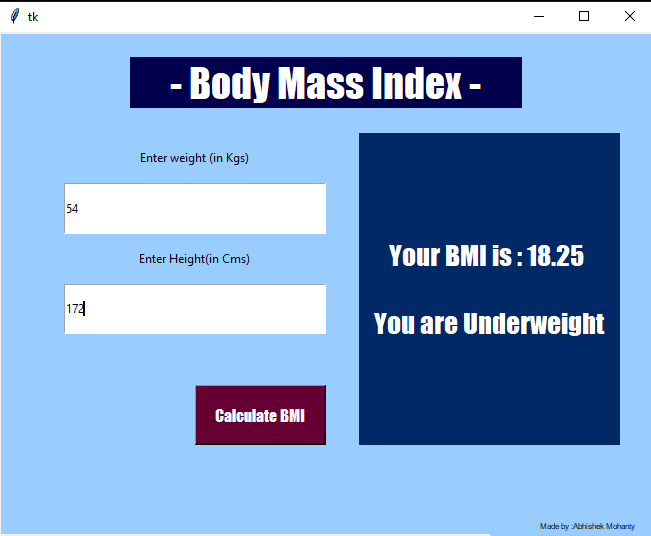
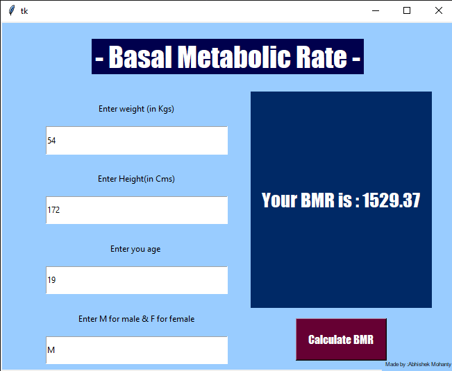
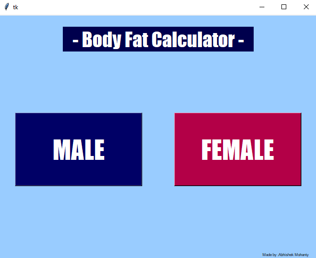
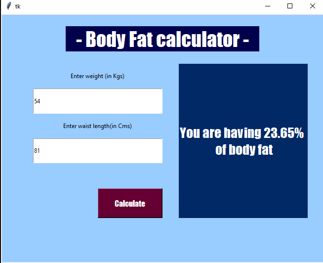

# Fitness_Calculator
A basic fitness calculator which calculates<strong> BMI,BMR and body fat percentage</strong> of an individual,using the Tkinther library of Python.
 
If using the jupyter notebook the then run each code block in sequential order and the mai interface will open up after running the last code block.

<strong> Do install Tkinter library in your python interpreter before running the code</strong>

UI:

Main Interface

Body Mass Index

 Basal Metabolic Rate
 

Body fat Calculator

if invalid input in enter it will give an error as no exceptional handling has been done.
